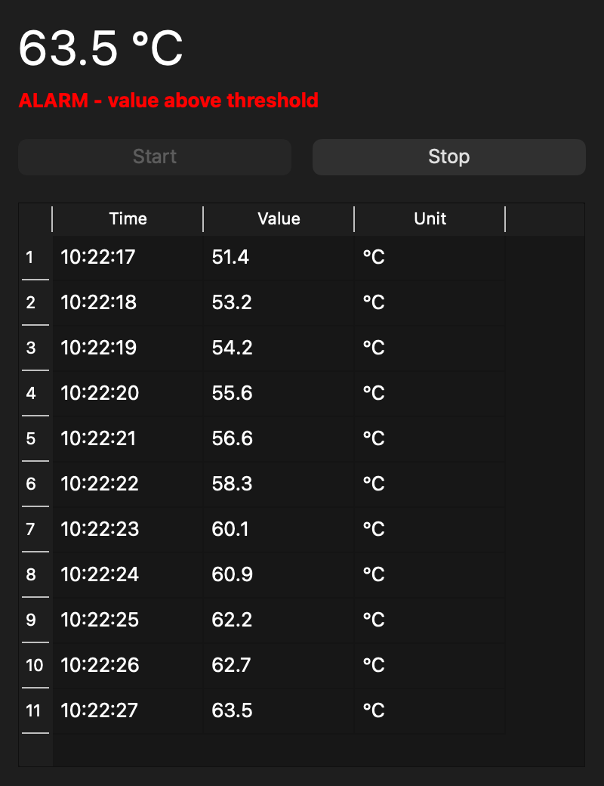

# LabLogger

[](https://github.com/KiwiComp/python_lab_logger/actions/workflows/ci.yml)

A measurement and control system in Python. An instrument reports measurements and drives
an alarm LED over a simple [TCP protocol](docs/protocol.md), while LabLogger reads, stores
and displays the measurements, in the terminal or in a desktop GUI.




## Features

- **Two interfaces:** a command-line tool (`lablogger`) and a desktop GUI built with
  PySide6 (`lablogger-gui`).
- **Two hardware instruments:** a Raspberry Pi that reports its CPU temperature, and an
  ESP32 running MicroPython that reads a potentiometer. Both switch an alarm LED and are
  reached over the network.
- **No hardware needed to try it:** a simulated device, and a fake instrument that speaks
  the real protocol on your own computer.
- **Alarm handling:** the LED is switched and an event is stored only when the alarm state
  changes.
- **Storage:** every measurement and alarm event is stored in SQLite, with UTC timestamps.
- **Tested:** automated tests and linting in CI, manual tests for the GUI and the hardware, and
  [requirements](docs/requirements.md) traced to the tests that verify them.


## Quick start

Requires Python 3.11 or newer.

```bash
git clone https://github.com/KiwiComp/python_lab_logger.git
cd python_lab_logger
python3 -m venv .venv
source .venv/bin/activate          # Windows: .venv\Scripts\Activate.ps1
pip install -e ".[gui,dev]"
```

Run with the simulated device, no hardware needed:

```bash
lablogger --count 20
lablogger-gui
```

Run against the fake instrument, in two terminals:

```bash
python tools/fake_instrument.py
```

```bash
lablogger --host 127.0.0.1 --channel potentiometer --unit raw --threshold 3000 --count 20
```

Run against a Raspberry Pi, set up as described in [docs/pi-setup.md](docs/pi-setup.md).
The default options are meant for its CPU temperature:

```bash
lablogger --host lablogger-pi.local --count 60
```

Run against an ESP32, set up as described in [docs/esp32-setup.md](docs/esp32-setup.md):

```bash
lablogger --host <ESP32 address> --channel potentiometer --unit raw --threshold 3000 --count 60
```

All ways to run LabLogger and all options are described in [docs/usage.md](docs/usage.md).


## How it works

```text
  lablogger (cli.py)    lablogger-gui (gui/)
           │                     │
           └──────────┬──────────┘
                      ▼
             MeasurementService ──► MeasurementRepository ──► SQLite
                      │
                      ▼
                   Device
           ┌──────────┴──────────┐
           ▼                     ▼
    SimulatedDevice          TcpDevice ──► instrument over TCP (Raspberry Pi, ESP32 or fake)
```

Both programs create a device and a repository and hand them to a `MeasurementService`,
which reads a value, stores it and handles the alarm. `Device` is an abstract base class,
so the service works the same way with the simulated device, a real instrument or the
fake devices used in the tests. The reasoning behind these and other choices is described
in [docs/design.md](docs/design.md).


## Project structure

```text
python_lab_logger/
├── pyproject.toml                  # Package metadata, dependencies and commands
├── README.md
├── LICENSE
├── .github/
│   └── workflows
│       └── ci.yml                  # CI: ruff and the tests on every push and pull request
├── docs/
│   ├── usage.md                    # Running LabLogger, options and stored data
│   ├── pi-setup.md                 # Setting up the Raspberry Pi instrument
│   ├── esp32-setup.md              # Wiring and installing the ESP32 instrument
│   ├── protocol.md                 # The TCP protocol to the instrument
│   ├── design.md                   # Design decisions
│   ├── requirements.md             # Requirements and the tests that verify them
│   ├── manual-tests.md             # Manual tests and test log
│   ├── troubleshooting.md          # Common problems and solutions
│   └── images/
│       └── gui.png                 # GUI screenshot used in this README
├── firmware/
│   ├── pi/                         # Raspberry Pi instrument
│   │   ├── instrument.py           # TCP server, CPU temperature and LED
│   │   └── lablogger-instrument.service
│   └── esp32/                      # ESP32 instrument (MicroPython)
│       ├── main.py                 # Firmware: Wi-Fi, TCP server, ADC and LED
│       └── wifi_config_example.py  # Template for wifi_config.py
├── src/lablogger/
│   ├── __init__.py
│   ├── errors.py                   # LabLoggerError, ProtocolError and DeviceError
│   ├── models.py                   # The Measurement data class
│   ├── options.py                  # Options shared by the CLI and the GUI
│   ├── protocol.py                 # Parsing of instrument responses
│   ├── storage.py                  # SQLite storage of measurements and events
│   ├── service.py                  # Measures, stores and handles the alarm
│   ├── cli.py                      # The lablogger command
│   ├── devices/
│   │   ├── __init__.py
│   │   ├── base.py                 # Device: abstract base class for devices
│   │   ├── simulated.py            # SimulatedDevice, no hardware needed
│   │   └── tcp_device.py           # TcpDevice, talks to an instrument over TCP
│   └── gui/
│       ├── __init__.py
│       ├── main_window.py          # The main window
│       └── app.py                  # The lablogger-gui command
├── tests/                          # Automated tests (pytest)
│   ├── test_options.py
│   ├── test_protocol.py
│   ├── test_storage.py
│   └── test_service.py
└── tools/
    └── fake_instrument.py          # Local stand-in for the instrument
```


## Development

```bash
pytest -v          # automated tests
ruff check .       # linting
ruff format .      # formatting
```

The same checks run in CI on every push and pull request. The GUI, the TCP communication
and the hardware are verified with the [manual tests](docs/manual-tests.md).


## Documentation

| Document | Content |
|---|---|
| [docs/usage.md](docs/usage.md) | Running LabLogger, all options and the stored data |
| [docs/pi-setup.md](docs/pi-setup.md) | Setting up the Raspberry Pi instrument |
| [docs/esp32-setup.md](docs/esp32-setup.md) | Wiring and installing the ESP32 instrument |
| [docs/protocol.md](docs/protocol.md) | The TCP protocol between LabLogger and the instrument |
| [docs/design.md](docs/design.md) | Design decisions |
| [docs/requirements.md](docs/requirements.md) | Requirements and the tests that verify them |
| [docs/manual-tests.md](docs/manual-tests.md) | Manual tests and test log |
| [docs/troubleshooting.md](docs/troubleshooting.md) | Common problems and how to solve them |


## Known limitations

- The Raspberry Pi instrument is started by hand; it does not start automatically when
  the Pi boots.
- No schema migrations: after a schema change, an existing database file must be deleted.
- No automatic reconnection if the connection to the instrument is lost.
- The instruments serve one LabLogger connection at a time.
- No authentication or encryption: only use it on a network you trust.


## License

LabLogger is released under the [MIT License](LICENSE).